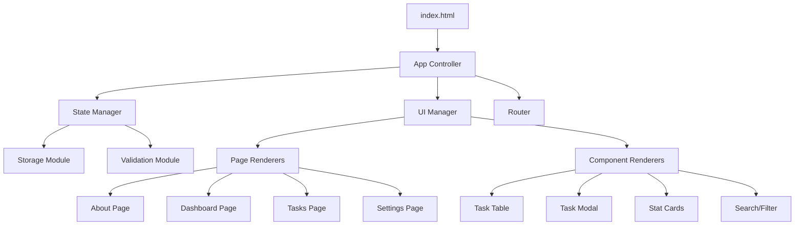

# Design Document

## Overview

This design document outlines the transformation of a React-based Campus Life Planner into a vanilla HTML/CSS/JavaScript application. The transformation will maintain 100% visual and functional parity with the original while adhering to strict academic assignment constraints. The application will be a single-page application (SPA) using vanilla technologies with modular JavaScript architecture.

### Key Design Principles

1. **Visual Fidelity**: Maintain exact visual appearance of the original React application
2. **Functional Parity**: Preserve all existing features and behaviors
3. **Accessibility First**: Ensure WCAG AA compliance and keyboard navigation
4. **Mobile-First Responsive**: Support all device sizes with fluid layouts
5. **Modular Architecture**: Clean separation of concerns using ES modules
6. **Performance Optimized**: Efficient DOM manipulation and minimal reflows

## Architecture

### High-Level Architecture



### File Structure

```
├── index.html
├── styles/
│   ├── main.css
│   ├── components.css
│   ├── pages.css
│   └── responsive.css
├── scripts/
│   ├── main.js
│   ├── state.js
│   ├── storage.js
│   ├── ui.js
│   ├── validators.js
│   ├── search.js
│   ├── utils.js
│   └── router.js
├── assets/
│   ├── icons/
│   └── images/
├── tests.html
├── seed.json
└── README.md
```

## Components and Interfaces

### 1. State Management (state.js)

**Purpose**: Centralized state management for tasks, settings, and UI state

**Interface**:
```javascript
class AppState {
  constructor()
  getTasks()
  addTask(task)
  updateTask(id, updates)
  deleteTask(id)
  getSettings()
  updateSettings(settings)
  getUIState()
  updateUIState(updates)
  subscribe(callback)
  unsubscribe(callback)
}
```

**Key Features**:
- Observable pattern for state changes
- Automatic localStorage persistence
- Validation integration
- Undo/redo capability for task operations

### 2. Storage Module (storage.js)

**Purpose**: Handle localStorage operations and JSON import/export

**Interface**:
```javascript
export const storage = {
  save(key, data),
  load(key, defaultValue),
  exportData(),
  importData(jsonString),
  validateImportData(data),
  clearAll()
}
```

**Key Features**:
- Automatic JSON serialization/deserialization
- Data validation before import
- Error handling for corrupted data
- Backup and restore functionality

### 3. UI Manager (ui.js)

**Purpose**: DOM manipulation and component rendering

**Interface**:
```javascript
class UIManager {
  constructor(state)
  render()
  renderPage(pageName)
  renderComponent(componentName, props)
  updateComponent(componentName, props)
  showModal(modalName, props)
  hideModal()
  showToast(message, type)
}
```

**Key Features**:
- Virtual DOM-like diffing for efficient updates
- Component-based rendering system
- Modal and toast management
- Focus management for accessibility

### 4. Router (router.js)

**Purpose**: Client-side routing for single-page navigation

**Interface**:
```javascript
class Router {
  constructor(routes)
  navigate(path)
  getCurrentRoute()
  addRoute(path, handler)
  start()
}
```

**Key Features**:
- Hash-based routing (#about, #dashboard, etc.)
- Browser history integration
- Route parameter extraction
- Navigation guards

### 5. Validation Module (validators.js)

**Purpose**: Form validation using regex patterns

**Interface**:
```javascript
export const validators = {
  title: /^\S(?:.*\S)?$/,
  duration: /^(0|[1-9]\d*)(\.\d{1,2})?$/,
  date: /^\d{4}-(0[1-9]|1[0-2])-(0[1-9]|[12]\d|3[01])$/,
  tag: /^[A-Za-z]+(?:[ -][A-Za-z]+)*$/,
  duplicateWords: /\b(\w+)\s+\1\b/i,
  
  validateField(field, value),
  validateTask(task),
  getErrorMessage(field, error)
}
```

**Key Features**:
- Real-time validation feedback
- Advanced regex patterns including back-references
- Internationalized error messages
- Custom validation rules

### 6. Search Module (search.js)

**Purpose**: Advanced search and filtering capabilities

**Interface**:
```javascript
export const search = {
  compileRegex(pattern, flags),
  searchTasks(tasks, query, options),
  highlightMatches(text, regex),
  filterTasks(tasks, filters),
  sortTasks(tasks, sortBy)
}
```

**Key Features**:
- Safe regex compilation with error handling
- Accessible text highlighting using `<mark>`
- Multiple search modes (text, regex, advanced)
- Real-time search results

## Data Models

### Task Model
```javascript
{
  id: "task_1234567890_abc123",           // Unique identifier
  title: "Complete JavaScript Assignment", // Task description
  dueDate: "2025-01-15",                  // YYYY-MM-DD format
  duration: 120,                          // Duration in minutes
  tag: "Programming",                     // Category/tag
  status: "Pending",                      // "Pending" | "Complete"
  createdAt: "2025-01-10T10:30:00.000Z", // ISO timestamp
  updatedAt: "2025-01-10T10:30:00.000Z"  // ISO timestamp
}
```

### Settings Model
```javascript
{
  timeUnit: "both",              // "minutes" | "hours" | "both"
  weeklyHourTarget: 40,          // Target hours per week
  theme: "light",                // "light" | "dark" (stretch feature)
  defaultTag: "General",         // Default tag for new tasks
  sortPreference: "date-newest", // Default sort order
  searchCaseSensitive: false     // Default search case sensitivity
}
```

### UI State Model
```javascript
{
  currentPage: "about",          // Current active page
  modalOpen: null,               // Currently open modal
  searchQuery: "",               // Current search query
  searchMode: "text",            // "text" | "regex"
  sortBy: "date-newest",         // Current sort order
  filterBy: "all",               // Current filter
  selectedTasks: [],             // Selected task IDs
  toastMessage: null             // Current toast message
}
```

## Error Handling

### Validation Errors
- Real-time field validation with inline error messages
- Form submission prevention when validation fails
- Accessible error announcements via ARIA live regions
- Clear error recovery instructions

### Runtime Errors
- Try-catch blocks around all async operations
- Graceful degradation for localStorage failures
- User-friendly error messages for import/export failures
- Console logging for debugging (development only)

### Network Errors
- Offline detection and user notification
- Retry mechanisms for failed operations
- Data persistence during connectivity issues

## Testing Strategy

### Unit Testing (tests.html)
```html
<!DOCTYPE html>
<html>
<head>
    <title>Campus Life Planner - Tests</title>
</head>
<body>
    <div id="test-results"></div>
    <script type="module">
        import { validators } from './scripts/validators.js';
        import { search } from './scripts/search.js';
        
        // Test validation patterns
        console.assert(validators.title.test("Valid Title"), "Title validation failed");
        console.assert(!validators.title.test(" Invalid "), "Title validation should fail");
        
        // Test regex search
        const regex = search.compileRegex("test", "i");
        console.assert(regex !== null, "Regex compilation failed");
        
        // Test duplicate word detection
        console.assert(validators.duplicateWords.test("test test"), "Duplicate word detection failed");
        
        document.getElementById('test-results').innerHTML = "All tests passed!";
    </script>
</body>
</html>
```

### Manual Testing Checklist
1. **Keyboard Navigation**: Tab through all interactive elements
2. **Screen Reader**: Test with NVDA/JAWS for accessibility
3. **Responsive Design**: Test on mobile, tablet, desktop viewports
4. **Form Validation**: Test all validation rules with edge cases
5. **Data Persistence**: Test localStorage save/load functionality
6. **Import/Export**: Test JSON import/export with various data sets

### Accessibility Testing
- Color contrast verification (4.5:1 ratio minimum)
- Focus indicator visibility
- ARIA label and description accuracy
- Keyboard-only navigation flow
- Screen reader announcement testing

## CSS Architecture

### Mobile-First Responsive Design

**Breakpoints**:
- Mobile: 360px and up (base styles)
- Tablet: 768px and up
- Desktop: 1024px and up
- Large Desktop: 1200px and up

**Layout Strategy**:
```css
/* Mobile-first base styles */
.container {
  padding: 1rem;
  max-width: 100%;
}

/* Tablet styles */
@media (min-width: 768px) {
  .container {
    padding: 1.5rem;
    max-width: 768px;
    margin: 0 auto;
  }
}

/* Desktop styles */
@media (min-width: 1024px) {
  .container {
    padding: 2rem;
    max-width: 1200px;
  }
}
```

### Component-Based CSS

**Naming Convention**: BEM (Block Element Modifier)
```css
/* Block */
.task-card { }

/* Element */
.task-card__title { }
.task-card__meta { }

/* Modifier */
.task-card--completed { }
.task-card--overdue { }
```

### CSS Custom Properties (Variables)
```css
:root {
  /* Colors */
  --color-primary: #2563eb;
  --color-primary-hover: #1d4ed8;
  --color-success: #059669;
  --color-warning: #d97706;
  --color-error: #dc2626;
  
  /* Typography */
  --font-size-sm: 0.875rem;
  --font-size-base: 1rem;
  --font-size-lg: 1.125rem;
  
  /* Spacing */
  --spacing-xs: 0.25rem;
  --spacing-sm: 0.5rem;
  --spacing-md: 1rem;
  --spacing-lg: 1.5rem;
  --spacing-xl: 2rem;
  
  /* Shadows */
  --shadow-sm: 0 1px 2px 0 rgb(0 0 0 / 0.05);
  --shadow-md: 0 4px 6px -1px rgb(0 0 0 / 0.1);
  --shadow-lg: 0 10px 15px -3px rgb(0 0 0 / 0.1);
}
```

### Animation and Transitions
```css
/* Smooth transitions for interactive elements */
.btn {
  transition: all 0.2s ease-in-out;
}

.btn:hover {
  transform: translateY(-1px);
  box-shadow: var(--shadow-lg);
}

/* Modal animations */
.modal {
  animation: modal-fade-in 0.3s ease-out;
}

@keyframes modal-fade-in {
  from {
    opacity: 0;
    transform: scale(0.95) translateY(10px);
  }
  to {
    opacity: 1;
    transform: scale(1) translateY(0);
  }
}

/* Loading animations */
.loading-spinner {
  animation: spin 1s linear infinite;
}

@keyframes spin {
  from { transform: rotate(0deg); }
  to { transform: rotate(360deg); }
}
```

## JavaScript Module Design

### ES Modules Structure
```javascript
// main.js - Application entry point
import { AppState } from './state.js';
import { UIManager } from './ui.js';
import { Router } from './router.js';

class App {
  constructor() {
    this.state = new AppState();
    this.ui = new UIManager(this.state);
    this.router = new Router();
    this.init();
  }
  
  init() {
    this.setupEventListeners();
    this.router.start();
    this.ui.render();
  }
}

// Initialize app when DOM is ready
document.addEventListener('DOMContentLoaded', () => {
  new App();
});
```

### Event Handling Strategy
```javascript
// Centralized event delegation
class EventManager {
  constructor() {
    this.handlers = new Map();
    this.setupDelegation();
  }
  
  setupDelegation() {
    document.addEventListener('click', this.handleClick.bind(this));
    document.addEventListener('input', this.handleInput.bind(this));
    document.addEventListener('submit', this.handleSubmit.bind(this));
  }
  
  handleClick(event) {
    const action = event.target.dataset.action;
    if (action && this.handlers.has(action)) {
      this.handlers.get(action)(event);
    }
  }
}
```

### Performance Optimizations
1. **Debounced Search**: Prevent excessive API calls during typing
2. **Virtual Scrolling**: Handle large task lists efficiently
3. **Lazy Loading**: Load components only when needed
4. **Memoization**: Cache expensive calculations
5. **Event Delegation**: Minimize event listener overhead

## Accessibility Implementation

### Semantic HTML Structure
```html
<!DOCTYPE html>
<html lang="en">
<head>
  <meta charset="UTF-8">
  <meta name="viewport" content="width=device-width, initial-scale=1.0">
  <title>Campus Life Planner</title>
</head>
<body>
  <!-- Skip link for keyboard users -->
  <a href="#main-content" class="skip-link">Skip to main content</a>
  
  <header role="banner">
    <nav role="navigation" aria-label="Main navigation">
      <!-- Navigation items -->
    </nav>
  </header>
  
  <main id="main-content" role="main">
    <!-- Page content -->
  </main>
  
  <footer role="contentinfo">
    <!-- Footer content -->
  </footer>
</body>
</html>
```

### ARIA Implementation
```html
<!-- Live regions for dynamic content -->
<div id="status-messages" aria-live="polite" aria-atomic="true" class="sr-only"></div>
<div id="error-messages" aria-live="assertive" aria-atomic="true" class="sr-only"></div>

<!-- Form with proper labeling -->
<form role="form" aria-labelledby="form-title">
  <h2 id="form-title">Add New Task</h2>
  
  <div class="form-group">
    <label for="task-title">Task Title <span aria-label="required">*</span></label>
    <input 
      id="task-title" 
      type="text" 
      required 
      aria-describedby="title-help title-error"
      aria-invalid="false"
    >
    <div id="title-help" class="help-text">Enter a descriptive title for your task</div>
    <div id="title-error" class="error-text" role="alert"></div>
  </div>
</form>

<!-- Data table with proper headers -->
<table role="table" aria-label="Tasks list">
  <thead>
    <tr>
      <th scope="col" aria-sort="none">
        <button aria-label="Sort by title">Title</button>
      </th>
      <th scope="col" aria-sort="none">
        <button aria-label="Sort by due date">Due Date</button>
      </th>
    </tr>
  </thead>
  <tbody>
    <!-- Table rows -->
  </tbody>
</table>
```

### Focus Management
```javascript
class FocusManager {
  constructor() {
    this.focusStack = [];
  }
  
  pushFocus(element) {
    this.focusStack.push(document.activeElement);
    element.focus();
  }
  
  popFocus() {
    const previousElement = this.focusStack.pop();
    if (previousElement) {
      previousElement.focus();
    }
  }
  
  trapFocus(container) {
    const focusableElements = container.querySelectorAll(
      'button, [href], input, select, textarea, [tabindex]:not([tabindex="-1"])'
    );
    
    const firstElement = focusableElements[0];
    const lastElement = focusableElements[focusableElements.length - 1];
    
    container.addEventListener('keydown', (e) => {
      if (e.key === 'Tab') {
        if (e.shiftKey && document.activeElement === firstElement) {
          e.preventDefault();
          lastElement.focus();
        } else if (!e.shiftKey && document.activeElement === lastElement) {
          e.preventDefault();
          firstElement.focus();
        }
      }
    });
  }
}
```

## Security Considerations

### Input Sanitization
```javascript
// HTML escaping for user input
function escapeHtml(text) {
  const div = document.createElement('div');
  div.textContent = text;
  return div.innerHTML;
}

// Safe regex compilation
function compileRegex(pattern, flags = '') {
  try {
    return new RegExp(pattern, flags);
  } catch (error) {
    console.warn('Invalid regex pattern:', pattern);
    return null;
  }
}
```

### Content Security Policy
```html
<meta http-equiv="Content-Security-Policy" content="
  default-src 'self';
  script-src 'self';
  style-src 'self' 'unsafe-inline';
  img-src 'self' data:;
  font-src 'self';
">
```

## Browser Compatibility

### Target Browsers
- Chrome 90+
- Firefox 88+
- Safari 14+
- Edge 90+

### Polyfills and Fallbacks
```javascript
// ES Module fallback for older browsers
if (!('noModule' in HTMLScriptElement.prototype)) {
  // Load polyfill or show upgrade message
  document.body.innerHTML = '<p>Please upgrade your browser to use this application.</p>';
}

// localStorage fallback
const storage = {
  getItem: (key) => {
    try {
      return localStorage.getItem(key);
    } catch {
      return sessionStorage.getItem(key) || null;
    }
  },
  setItem: (key, value) => {
    try {
      localStorage.setItem(key, value);
    } catch {
      sessionStorage.setItem(key, value);
    }
  }
};
```

This design ensures a robust, accessible, and maintainable vanilla JavaScript application that meets all assignment requirements while preserving the quality and functionality of the original React implementation.